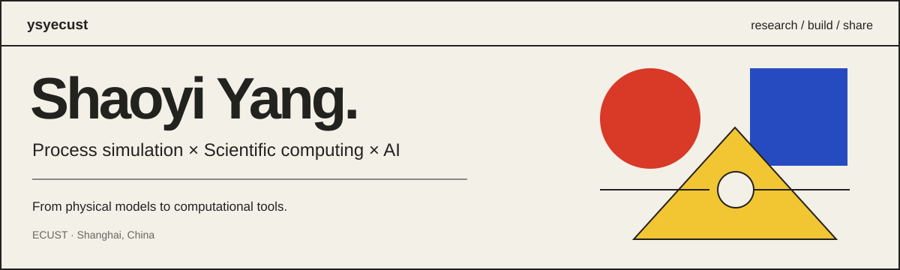

  <a href="https://blog.simona.plus/"><b>Website</b></a> &nbsp; / &nbsp;
  <a href="https://scholar.google.com/citations?user=4QYe0ZQAAAAJ&hl=en"><b>Google Scholar</b></a> &nbsp; / &nbsp;
  <a href="https://blog.simona.plus/research/"><b>Research</b></a> &nbsp; / &nbsp;
  <a href="https://blog.simona.plus/lecture-to-notes/"><b>Course library</b></a> &nbsp; / &nbsp;
  <a href="mailto:ysyecust@gmail.com"><b>Email</b></a>

I'm **Shaoyi Yang (杨邵毅)**, also known as **逸少**, working on process systems engineering at **East China University of Science and Technology** in Shanghai.

I study how physical models become executable simulations, and build tools for research, software development, and learning. My interests connect thermodynamics and nonlinear computation with task-graph parallelism, GPU computing, and AI-assisted engineering.

### Research directions

- **Process simulation:** thermodynamic properties, phase equilibrium, model formulation, and automatic differentiation.
- **Scientific computing:** parallel execution, GPU kernels, and the numerical methods behind engineering software.
- **AI for engineering:** agents for chemical process design and tools that help people develop, read, and write.

### Selected projects

| Project | What it does |
| :--- | :--- |
| **[lecture-to-notes](https://github.com/ysyecust/lecture-to-notes)** | Turns YouTube, Bilibili, and X lectures into Chinese LaTeX/PDF notes, with timestamped figures and verification records. [Browse the library](https://blog.simona.plus/lecture-to-notes/). |
| **[pcsaft-dispersion-homotopy](https://github.com/ysyecust/pcsaft-dispersion-homotopy)** | Studies PC-SAFT density roots using dispersion-strength homotopy and adaptive pseudo-arclength continuation. |
| **[write-reader-first-papers](https://github.com/ysyecust/write-reader-first-papers)** | A reader-first academic writing skill for Codex and Claude Code. |
| **[everything-claude-code](https://github.com/ysyecust/everything-claude-code)** | Development configurations for C++20/HPC work, including agents, skills, hooks, and rules. |
| **[claude-lark](https://github.com/ysyecust/claude-lark)** | Sends Claude Code task notifications to Lark/Feishu. |
| **[codeboard](https://github.com/ysyecust/codeboard)** | A terminal dashboard for local Git repositories, branches, and recent activity. |

### Selected publications

- **[From Text to Simulation: A Multi-Agent LLM Workflow for Automated Chemical Process Design](https://ojs.aaai.org/index.php/AAAI/article/view/40215)** — Tian, Du, Yang et al. · AAAI, 2026.
- **[A Hierarchical Task Graph Parallel Computing Framework for Chemical Process Simulation](https://www.engineering.org.cn/engi/EN/1160001122553356779)** — Qu, Yang, Du et al. · Engineering, 2025.
- **[The potential and challenges of large language model agent systems in chemical process simulation](https://journal.hep.com.cn/fcse/EN/10.1007/s11705-025-2587-5)** — Du and Yang · Frontiers of Chemical Science and Engineering, 2025.

[More publications and preprints](https://blog.simona.plus/research/) · [Google Scholar](https://scholar.google.com/citations?user=4QYe0ZQAAAAJ&hl=en)

### Notes from practice

I share [technical articles](https://blog.simona.plus/archives/), [paper readings](https://blog.simona.plus/paper-notes/), and a [public course library](https://blog.simona.plus/lecture-to-notes/). The latest project introduction explains [how lecture-to-notes turns videos into reusable study materials](https://blog.simona.plus/2026/09/08/lecture-to-notes-reader-first/).

**Tools I work with:** C++ · Python · CUDA · CMake · LaTeX · Linux · Git

Recent GitHub activity

<!--START_SECTION:activity-->
1. 🎉 Merged PR [#22](https://github.com/ysyecust/lecture-to-notes/pull/22) in [ysyecust/lecture-to-notes](https://github.com/ysyecust/lecture-to-notes)
2. 💪 Opened PR [#22](https://github.com/ysyecust/lecture-to-notes/pull/22) in [ysyecust/lecture-to-notes](https://github.com/ysyecust/lecture-to-notes)
3. 🎉 Merged PR [#21](https://github.com/ysyecust/lecture-to-notes/pull/21) in [ysyecust/lecture-to-notes](https://github.com/ysyecust/lecture-to-notes)
4. 💪 Opened PR [#21](https://github.com/ysyecust/lecture-to-notes/pull/21) in [ysyecust/lecture-to-notes](https://github.com/ysyecust/lecture-to-notes)
5. 🎉 Merged PR [#20](https://github.com/ysyecust/lecture-to-notes/pull/20) in [ysyecust/lecture-to-notes](https://github.com/ysyecust/lecture-to-notes)
<!--END_SECTION:activity-->

---

**欢迎用中文交流。** I'm happy to discuss process simulation, scientific computing, and practical AI tools. Reach me at [ysyecust@gmail.com](mailto:ysyecust@gmail.com).
